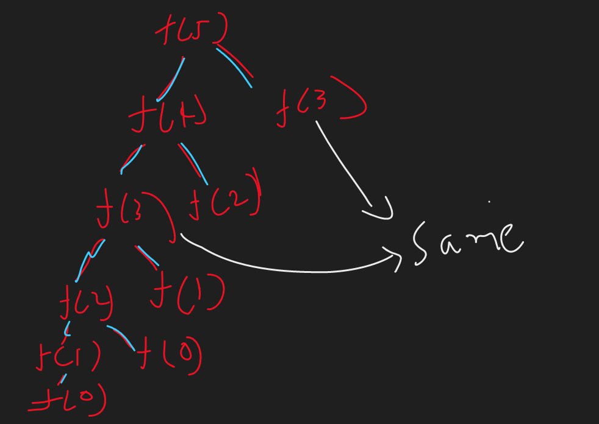
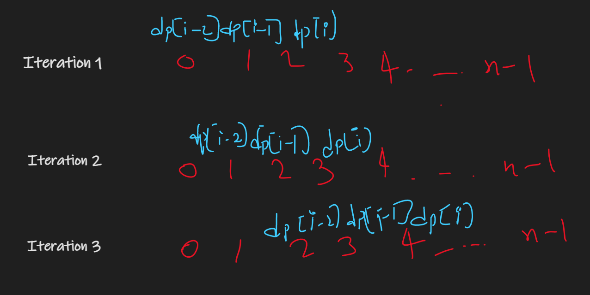

## Problem statement:

> In this problem there is a one frog and it wants to reach the Nth stair starting from 1st stair. Frog can jump ==only 1 or 2 stairs== at a time and the jump costs a[i]-a[j] where i is the starting index of jump and j is ending point of jump. Your task is to find the mimimum enegery in which frog can reach N.

### Example:

If we have an array `[10 20 30 10]` then we have following 3 possibilities.


## Recursive Approach:

--> So From diagram we can see that we have to find all possiblities and then find the minimum of it.

So our code for finding all possibilities will be like this :

> Note:We will start from right side means from last index and go till 0th index.

```cpp
int singleJump = solve(arr[n-1]) + abs(arr[ind]-arr[ind-1]); // Adding cost for single jump
int doubleJump = solve(arr[n-2]) + abs(arr[ind]-arr[ind-2]); // Adding cost for double jump
```

But there is one condition that if `ind==1` then we can't find `ind-2` for it.

Also if `ind==0` then we have to return `0`
So we just have to modify a code bit.

```cpp
if(ind == 0){
	return 0;
}
int singleJump = solve(arr[n-1]) + abs(arr[ind]-arr[ind-1]);
if(ind > 1){
	int doubleJump = solve(arr[n-2]) + abs(arr[ind]-arr[ind-2]);
}
```

Now we just have to find minimum of `singleJump` and `doubleJump` and it will be our answer.

Now if we draw recursion tree for Array `[30 10 60 10 60 50]` this then it will look like this:


## Converting to DP

Here we can see that function calls are overlapping. For example `f(3)` is getting called 2 times. So we can store the answer of f(3) in our dp array and return it directly whenever we got another call for `f(3)` without doing it again.



So we need an array of size of `n+1` and just store the answer before returning it.

Also we have to check it before calling the recursive functions that if there is a already answer present for current function call, then just return that answer.

So ==Memoized Code== Will look like this:

```cpp
int solve(int i,vector<int>&arr,vector<int>&dp){
	if(i == 0){
		return 0;
	}
	if(dp[i] != -1){
		return dp[i];
	}
	int doubleJump = INT_MAX;
	int singleJump = solve(i-1,arr,dp) + abs(arr[i]-arr[i-1]);
	if(i>1){
		doubleJump = solve(i-2,arr,dp) + abs(arr[i]-arr[i-2]);
	}
	return dp[i] = min(singleJump,doubleJump);
}
int frogJump(int n,vector<int>&arr){
	vector<int>dp(n+1,-1);
	return solve(n-1,arr,dp);
}
```

## Converting to tabulation

--> So we have done memoization which is top-down method. Now we will convert this in tabulation which is bottom-up in which we start from `0` and go till `n-1`

So here first we will initialise our dp array with `0` because we are gonna add everything in dp array now.

```cpp
vector<int>dp(n,0);
```

Now we will check the base case in memoization code which is :

```cpp
if(i == 0){
	return 0;
}
```

--> So we will initialise `dp[0]` with 0.
Now we will run the loop of `1 to n-1` and then do the same which we did in memoization code but this time we will use dp array like this:

```cpp
int singleJump = dp[i-1] + abs(a[i]-a[i-1]);
int doubleJump = INT_MAX;
if(i>1){
	doubleJump = dp[i-2] + abs(a[i]-a[i-2]);
}
return dp[i] = min(singleJump,doubleJump);
```

## Space optimisation

--> So first of all let's see the flow of dp array in diagram.



So here we can see that we are just changing `3` values. which are current element, curr-1 and curr-2. so **why don't we add them in variable instead of using an array and just change the variables in each iteration?**

So let's suppose we will store current i in `curr` variable, i-1 in `prev` and i-2 in `prev2` variable.

So our code will look like this:

```cpp
int prev = 0,prev2=0,curr=0;
for(int i=1 -> n-1){
	int singleJump = prev + abs(a[i]-a[i-1]);
	int doubleJump = INT_MAX;
	if(i>1){
		doubleJump = prev2 + abs(a[i]-a[i-2]);
	}
	curr = min(singleJump,doubleJump);
	prev2 = prev;
	prev = curr;
}
return prev; // curr will be n and prev will be n-1 and prev2 will be n-2 so we need answer for n-1 which is last index that's why we are returning prev
```

## Similar question

--> Now let's change the question a bit and now you are allowed to jump till `k`th index. For example in the previous question you were allowed to only jump for `i+1` and `i+2` but this time you can jump for `i+1,i+2,i+3....i+k` So let's see how we can change our code from previous question to solve this problem.

so we will run one inner loop which will go from `1->k` and it will find answer for all jumps and at last we will take minimum of all answers.

```cpp
if(idx == 0){
	return 0;
}
int minJumps = INT_MAX;
for(int j=1;j<=k;j++){
	if(idx-j >= 0){ // This is to prevent negative index
		int jump = solve(idx-j) + abs(arr[idx] + arr[idx-j]);
	}
		minJumps = min(minJumps,jump);
}
return minJumps;
```

## Converting to memoization

--> we will store the answers in the dp array and run the loop of `i` and `j` instead of making recursive call.

So the code will look like this:

```cpp
solve(int idx){
	vector<int>dp(n,0);
	dp[0] = 0;
	for(int i=1;i<n;i++){ // This will traverse array elements
		int minJumps = INT_MAX;
		for(int j=1;j<=k;j++){ // This will go till k
			if(i-j >= 0){ // This is for preventing negative index
				int jump = dp[i-j] + abs(arr[i]+arr[i-j]);
				minJumps = min(minJumps,jump);
			}
		}
		dp[i] = minJumps;
	}
	return dp[n-1];
}
```

```
Time complexity: O(n*k)
Space complexity: O(N)
```
