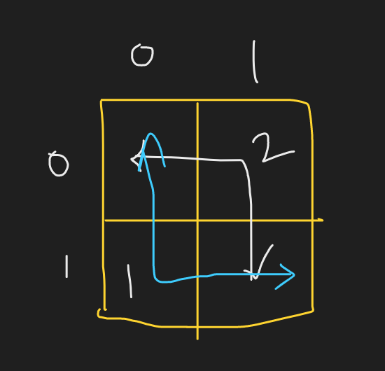

## Problem:

> You are present at point ‘A’ which is the top-left cell of an M X N matrix, your destination is point ‘B’, which is the bottom-right cell of the same matrix. Your task is to find the total number of unique paths from point ‘A’ to point ‘B’.In other words, you will be given the dimensions of the matrix as integers ‘M’ and ‘N’, your task is to find the total number of unique paths from the cell MATRIX[0][0] to MATRIX['M' - 1]['n' - 1].
> To traverse in the matrix, you can either move Right or Down at each step. For example in a given point MATRIX[i] [j], you can move to either MATRIX[i + 1][j] or MATRIX[i][j + 1].

## Example:

Input:

```
2 2
```

Output:

```
2
```

Explaination:



## Approach:

--> So here they have said that ==Find all the possible ways which gives us hint that we have to use recursion here==

So we will start from `[n-1][m-1]` and go till `[0][0]`

## Base case

--> If we reach 0,0 then we have to return `1`

--> But if we go out of boundry of row or column i.e i or j becomes negative then we don't have to count that in our path so we will return `0`

```cpp
if(i == 0 && j == 0){
	return 1;
}
if(i<0 || j<0){
	return 0;
}
```

## Approach (Continue)

--> Now here we are starting from bottom right so here we have to go ==up and left== which is completely opposite direction of given in question.

So we will go in both directions and return the sum of them.

```cpp
int up = solve(i-1,j);
int down = solve(i,j-1);
return up+down;
```

## Complexity:

```
Time complexity: O(2^m*n)
Space complexity: O((m-1)+(n-1))
```

## Memoization

--> Here also we can see overlapping problems so we can apply memoization here and convert it to DP.

Here i and j are changing so we will take them in our dp array. And we will make it size of `mxn` because these are the maximum sizes for i and j.

```cpp
int solve(int i,int j,vector<vector<int>>&dp){
	if(i == 0 && j == 0){
		return 1;
	}
	if(i<0 || j<0){
		return 0;
	}
	if(dp[i][j] != -1){
		return dp[i][j];
	}
	int up = solve(i-1,j,dp);
	int left = solve(i,j-1,dp);
	return dp[i][j] = up+left;
}

vector<vector<int>>dp(m,vector<int>(n,-1));
solve(m-1,n-1,dp);
```

## Tabulation Code:

```cpp
int solve(int n,int m){
	for(int i=0;i<n;i++){
		for(int j=0;j<m;j++){
			// First base case
			if(i==0 && j == 0){
				dp[i][j] = 1;
			}else{
				int up=0,left=0;
				// second base case to prevent from going outside of row or column
				if(i > 0){
					up = dp[i-1][j];
				}
				if(j > 0){
					left = dp[i][j-1];
				}
				dp[i][j] = up+left;
			}
		}
	}
	return dp[n-1][m-1];
}
```

## Complexity:

```
Time Complexity: O(n*m);
Space complexity: O(n*m);
```
