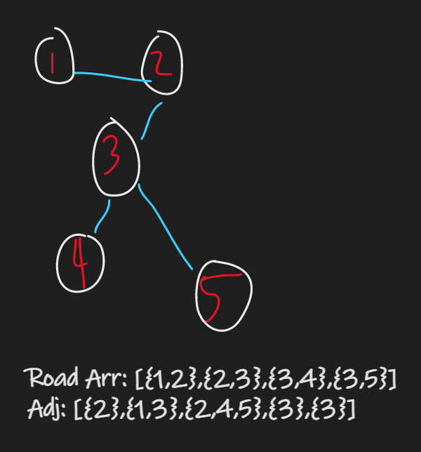

## Problem Statement:

> Geek town has N Houses numbered from 1 to N. They are connected with each other via N-1 bidirectional roads and an adjacency list is used to represent the connections. To host the optimal party, you need to identify the house from which the distance to the farthest house is minimum. Find this distance.

### Example:

**Input:**
N = 4
Roads = {{1,2},{2,3},{2,4}}
adj = {{2},{1,3,4},{2},{2}}

**Output:** 1

**Explaination:**

Party should take place at house number 2.
Maximum distance from house number 2 is 1.

## Dry run:

--> So in this problem, we have to find the furtherst path for each node and then take the minimum from all that paths.

For example:



In this graph the longest path length for `1` will be `3` which is `1->2->3->5`

--> For node `2` possible paths are:

```
2->3->5
2->3->4
2->1
```

But here we want fartherest distance so we will take either `2->3->4` or `2->3->5` which have length of `3`

--> For node `3` possible paths are:

```
3->2->1
3->4
3->5
```

Here longest path length will be 3 which is `3->2->1`

And like this we will get all longest path lengths for all nodes which will be like this:

```
For node 1 -> 3
For node 2 -> 2
For node 3 -> 2
For node 4 -> 3
For node 5 -> 3
```

And now we have to take minimum of this which will be `2` and it's our answer.

## Approach:

--> we will do `DFS Traversal` and maintain one count which will store maximum length and each time we will do this:

```cpp
ans = min(ans,maxCountForCurrent);
```

at last we will return `ans`

--> Also we have to mark all nodes unvisited after we complete the dfs for one node because we have to do dfs for all nodes.

==> Final code will look like this:

```cpp
	int maxCountForCurrent = 0; // It will store maximum path length for current node
    void dfs(int node,vector<int>&vis,vector<vector<int>>&adj,int currCount){
        maxCountForCurrent = max(maxCountForCurrent,currCount);
        vis[node] = 1;
        for(auto it:adj[node]){
            if(!vis[it]){
                dfs(it,vis,adj,currCount+1);
            }
        }
        vis[node] = 0; // backtracking
    }
    int partyHouse(int N, vector<vector<int>> &adj){
        int ans = N-1;
        vector<int>vis(N+1,0);
        for(int i=1;i<=N;i++){
            maxCountForCurrent = 0;
            dfs(i,vis,adj,0);
            ans = min(ans,maxCountForCurrent);
        }
        return ans;
    }
```
