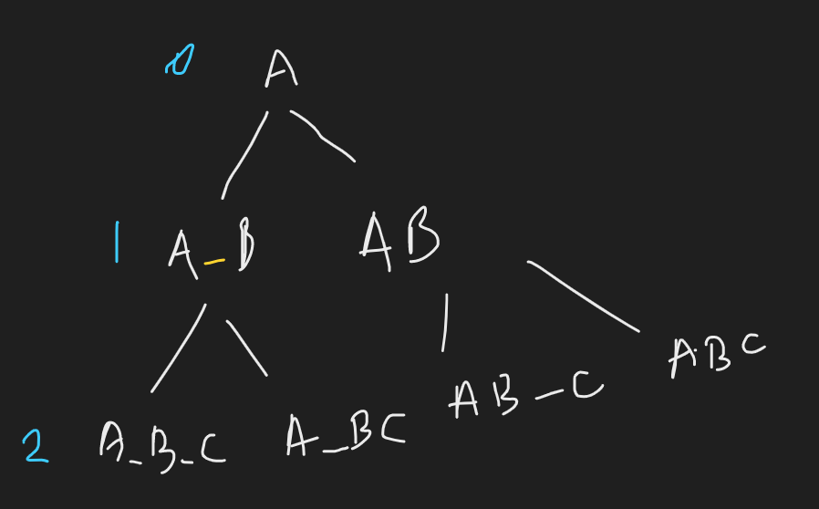

## Problem:

> Given a string you need to print all possible strings that can be made by placing spaces (zero or one) in between them. The output should be printed in **sorted** **increasing** order of strings

## Example:

**Input**:

```
S = "ABC"
```

**Output:**

```
(A B C)(A BC)(AB C)(ABC)
```

**Explanation**:

```
ABC
AB C
A BC
A B C
These are the possible combination of "ABC".
```

## Approach:

--> Here we have 2 conditions:

1. Add space
2. Don't add space

So we will simply make 2 recursive call and recursive tree will look like this:



So we will store our temp strings in `temp` variable.

--> But here after first call we have to do some backtracking because when we will do second call then the `temp` value will have modified value from first call so we have to change it.

So it will look like this:


So here we can see that we are getting wrong answer so ==we have to do backtracking here== which we can do by just removing the last 2 elements of current `temp` which we will do like this:

```cpp
temp = temp.substr(0,temp.size()-2);
```

## Code

```cpp
void solve(string S,string temp,int i,vector<string>&ans){
        if(i == S.length()){
            ans.push_back(temp);
            return;
        }
        // If we take space
        temp += " ";
        temp += S[i];
        solve(S,temp,i+1,ans);
		// If we don't take space
        temp = temp.substr(0,temp.size()-2);
        temp += S[i];
        solve(S,temp,i+1,ans);
    }
    vector<string> permutation(string S){
        string temp = "";
        temp += S[0];
        vector<string>ans;
        if(S.length() == 1){
            ans.push_back(S);
        }
        else{
            solve(S,temp,1,ans);
        }
        return ans;
    }
```
